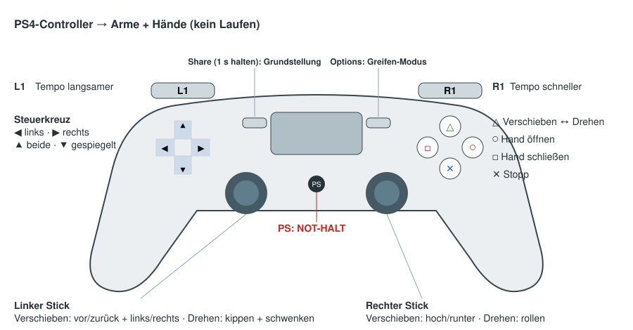

# PS4-Controller für den Oberkörper (Arme + Hände)

Ein PS4-Controller (DualShock 4) steuert die Hände des G1: Position und
Drehung beider Hände, Hände auf/zu, Grundstellung, Stopp und NOT-HALT.
**Laufen ist bewusst nicht belegt** — der Controller kann den Roboter weder
loslaufen lassen noch drehen.

Stand: **nur Simulation**. Der Real-Start (`bringup_real`) bleibt unverändert;
dort liest weiterhin der alte `joystick`-Node den Controller für `loco_client`.

## Starten

- **Startmenü (GUI):** Simulation → Ausstattung → Schalter **PS4-Controller**.
- **Text-Menü:** Frage *3c) PS4-Controller für Arme + Hände?* → Ja.
- **Ohne Menü:** `G1_PS4_ARMS=1 ./start.sh --yes`

Den Controller per Bluetooth koppeln oder per USB anstecken — vor oder nach
dem Start, auch ein kurzer Funkabriss ist kein Problem (er verbindet sich
selbst neu). Zuerst **Options** drücken: der Roboter steht und die Arme
gehören dem Controller (wie die Kachel GREIFEN in der Demo-GUI).

## Belegung



| Taste | Wirkung |
|---|---|
| Steuerkreuz ← | **linke** Hand wählen (LED blau) |
| Steuerkreuz → | **rechte** Hand wählen (LED grün, Standard) |
| Steuerkreuz ↑ | **beide** Hände, parallel (LED violett) — z. B. eine Kiste tragen |
| Steuerkreuz ↓ | **beide gespiegelt** (LED türkis): links/rechts und Drehungen spiegelbildlich, Bezug ist die rechte Hand — z. B. Hände auseinander/zueinander |
| Dreieck | Umschalten **VERSCHIEBEN ↔ DREHEN** (beim Drehen leuchtet die LED gedimmt) |
| Linker Stick | VERSCHIEBEN: vor/zurück + links/rechts · DREHEN: kippen (Finger hoch/runter) + schwenken |
| Rechter Stick | VERSCHIEBEN: hoch/runter (vertikal) · DREHEN: rollen (horizontal) |
| L1 / R1 | Tempo langsamer / schneller: Langsam 5 cm/s · **Normal 15 cm/s** · Schnell 30 cm/s (Drehen 20 / 45 / 90 °/s) |
| Kreis | gewählte Hand(e) **öffnen** |
| Viereck | gewählte Hand(e) **schließen** |
| Kreuz | **Stopp**: Hand hält sofort an, eine laufende geplante Bewegung (Grundstellung, Ablauf) wird abgebrochen |
| Options | Greifen-Modus: stehen + Arme übernehmen |
| Share **1 s halten** | Grundstellung (Arme neben den Körper, geplant um Hindernisse herum) |
| PS | **NOT-HALT** (wie in den GUIs: Arme schlaff, Roboter gedämpft) |
| L2, R2, L3, R3, Touchpad | frei (Reserve) |

Richtungen gelten **aus Sicht des Roboters** (vor = in Blickrichtung des
Roboters, links = Roboter-links). Steht man dem Roboter gegenüber, sind
links/rechts also vertauscht.

Loslassen = Hand steht. Die Hand läuft dem Stick höchstens ein kleines Stück
voraus (wie in der Demo-GUI); kommt der Arm nicht weiter (Gelenkgrenze,
Kollisions-Gate vor Körper/Tisch), wandert das Ziel nicht davon.

**Rückmeldung**, welche Hand aktiv ist:
- Controller-LED in der Farbe der Auswahl (siehe Tabelle), rot bei NOT-HALT,
- kurze Vibration bei jedem Umschalten, lange bei NOT-HALT,
- in RViz eine farbige Kugel an der aktiven Hand und ein Text über dem
  Roboter (`PS4 · RECHTS · Verschieben · Normal`), Display „PS4-Controller“.

Hände öffnen/schließen wirkt mit **Inspire-Händen**; mit den starren Händen
passiert dabei nichts.

## NOT-HALT und Quittieren

PS löst den NOT-HALT aus. Danach ignoriert der Controller alles außer PS, bis
in der Demo-GUI ein Modus gewählt bzw. im Streamdeck START gedrückt wurde.
Das Quittieren liegt absichtlich nicht auf dem Controller: in der Sim setzt
START den Roboter auch zurück.

## Verbindung, Container, LED

- Der Sim-Container bekommt `/dev/input` über `docker-compose.ps4.yml`
  (start.sh nimmt die Datei automatisch dazu, wenn `G1_PS4_ARMS=1`). Kein
  `privileged`; erlaubt ist nur das Öffnen von Eingabegeräten.
- Die **LED** wird über sysfs gesetzt. Das ist im Sim-Container schreibgeschützt
  — dann bleibt die LED wie sie ist und die Auswahl zeigen RViz und die
  Vibration. Ein Hinweis steht einmal im Log.
- Gerätename: Bluetooth meldet „Wireless Controller“, USB je nach Treiber
  „Sony Interactive Entertainment Wireless Controller“ — beides wird erkannt.
  Anderer Name: `JOYSTICK_NAME=...`.
- Unter WSL gibt es kein `/dev/input` → der Controller ist dort nicht nutzbar
  (start.sh warnt).

## Fehlerbehebung

| Symptom | Ursache / Abhilfe |
|---|---|
| Log: „Kein PS4-Controller gefunden … Warte“ | Controller nicht gekoppelt oder Container ohne `/dev/input` (über start.sh starten bzw. `COMPOSE_FILE=…:docker-compose.ps4.yml`). |
| Status-Text zeigt die Auswahl, aber die Hand bewegt sich nicht | Arme nicht übernommen → **Options** drücken (oder GUI: GREIFEN). Im Gehen-Modus hängen die Arme in der Lauf-Pose. |
| Hand bleibt an einer Stelle hängen | Kollisions-Gate (Log: „Kollisions-Gate …“) oder Reichweite erreicht → in eine andere Richtung bewegen. |
| Nach PS reagiert nichts mehr | NOT-HALT aktiv → in der GUI quittieren (Modus wählen). |

---

## Technik

### Dateien

| Datei | Inhalt |
|---|---|
| `g1pilot/teleoperation/ps4_joystick.py` | Node `ps4_joystick`: evdev → `/g1pilot/ps4/joy` in fester Belegung, Wiederverbinden, LED (sysfs) + Vibration (Force-Feedback) aus `/g1pilot/ps4/feedback` |
| `g1pilot/teleoperation/ps4_layout.py` | feste Belegung (Indizes) und evdev-Code-Zuordnung, ohne ROS/evdev testbar |
| `g1pilot/teleoperation/ps4_arm_teleop.py` | `ArmTeleopLogic` (reine Bedienlogik) + Node `ps4_arm_teleop` |
| `g1pilot/teleoperation/hand_jog.py` | Jog-Rechnung (Ziel = Hand + Geschwindigkeit, Vorlauf begrenzt), gemeinsam mit der Demo-GUI |
| `launch/teleoperation_launcher.launch.py` | Argument `ps4_arms` (Default `false`): startet `ps4_joystick` + `ps4_arm_teleop` statt `joystick` |
| `launch/bringup_sim.launch.py` | setzt `ps4_arms` aus `G1_PS4_ARMS` |
| `docker-compose.ps4.yml` | `/dev/input` + `device_cgroup_rules: c 13:* rmw` für `g1pilot-sim` |
| `test/test_ps4_arm_teleop.py`, `test/test_ps4_joystick.py` | Unit-Tests (Belegung, Logik, Jog, simuliertes evdev-Gerät) |
| `test_ps4_arm_sim.py` | Ende-zu-Ende-Test gegen die laufende Sim (simulierte Joy-Eingabe) |

### Datenfluss

```
DualShock 4 ──evdev──> ps4_joystick ──/g1pilot/ps4/joy (Joy, feste Belegung)──> ps4_arm_teleop
                            ^                                                        │
                            └──── /g1pilot/ps4/feedback (LED, Vibration) ────────────┤
                                                                                     ├─> /g1pilot/hand_goal/<side>   (PoseStamped, pelvis)
                                                                                     ├─> /g1pilot/hand_action/<side> ("open"/"close")
                                                                                     ├─> /g1pilot/arms/enabled, /g1pilot/start_balancing (Options)
                                                                                     ├─> /g1pilot/arms/home (Share, Impuls)
                                                                                     ├─> /g1pilot/pose_store/cancel (Kreuz)
                                                                                     ├─> /g1pilot/emergency_stop (PS)
                                                                                     ├─> /g1pilot/ps4/status (JSON, latched)
                                                                                     └─> /g1pilot/ps4/markers (RViz)
```

Bewusst **nicht** über `joy_mux`/`/g1pilot/joy`: dort hängen `joy_to_cmdvel`
(Sim, mit Navigation) und `loco_client` (real) — die Sticks würden sonst den
Roboter laufen lassen. Der alte `joystick`-Node startet im PS4-Modus nicht,
weil er denselben Controller lesen würde.

### Feste Belegung (`/g1pilot/ps4/joy`)

Achsen wie beim ROS-Paket `joy`: links = +1, oben = +1; Trigger 0…1.

| Index | Achse | Index | Taste |
|---|---|---|---|
| 0 | linker Stick X | 0–3 | Kreuz, Kreis, Dreieck, Viereck |
| 1 | linker Stick Y | 4–7 | L1, R1, L2, R2 |
| 2 | rechter Stick X | 8–10 | Share, Options, PS |
| 3 | rechter Stick Y | 11–12 | L3, R3 |
| 4–5 | L2, R2 (0…1) | 13–16 | Steuerkreuz oben, unten, links, rechts |
| 6–7 | Steuerkreuz X, Y | | |

Die evdev-Codes sind die des Linux-Treibers (hid-sony ab Kernel 4.10,
hid-playstation). Der alte `joystick`-Node nummeriert dagegen in
Geräte-Reihenfolge — für eine Tastenbelegung zu wackelig.

### Sicherheit

- Totzone 0.12 (mit Neuskalierung) + Expo 0.4 → kein Kriechen, feinfühlig um die Mitte.
- Kein Joy länger als 0.5 s (`joy_timeout_s`) → Hand hält an. `ps4_joystick`
  publiziert ohne Verbindung **nichts** (kein eingefrorener Wert).
- Abgewählte Hand hält sofort an (Ziel = echte Hand).
- Grundstellung nur nach 1 s Halten von Share.
- NOT-HALT sperrt den Controller bis zur Quittung (`/g1pilot/start`).
- Alle Ziele laufen durch den arm_controller (IK, Kollisions-Gate, EE-Tempo-Limit).

### Parameter `ps4_arm_teleop`

| Parameter | Default | Bedeutung |
|---|---|---|
| `joy_topic` | `/g1pilot/ps4/joy` | Eingang |
| `rate_hz` | 30 | Takt der Hand-Ziele |
| `deadzone` / `expo` | 0.12 / 0.4 | Stick-Kennlinie |
| `speed` | `Normal` | Start-Tempo |
| `home_hold_s` | 1.0 | Share-Haltezeit für Grundstellung |
| `joy_timeout_s` | 0.5 | Abriss-Erkennung |
| `options_starts_balancing` | `true` | Options sendet zusätzlich `start_balancing` |

### Tests

```bash
# Unit-Tests (ohne Controller; test_ps4_joystick braucht rclpy -> im Container)
python3 -m pytest -q test/test_ps4_arm_teleop.py test/test_ps4_joystick.py

# Ende-zu-Ende gegen die laufende Sim (G1_PS4_ARMS=1, Controller nicht nötig)
docker exec -it g1pilot-g1pilot-sim-1 bash -c \
  "source /ros2_ws/install/setup.bash && python3 /ros2_ws/src/g1pilot/test_ps4_arm_sim.py"
```

Der Sim-Test fährt jede Prüfung aus derselben Ausgangslage (Grundstellung,
dann beide Hände nach vorn) und misst per TF: Richtung je Stick, nur die
gewählte Hand bewegt sich, Drehen ohne Versatz, Spiegeln, Hände auf/zu
(Finger-Gelenke), Abriss, Share/Kreuz, NOT-HALT — und dass dabei kein
Laufbefehl entsteht und die Basis stehen bleibt. Am Ende steht der Roboter
im NOT-HALT (`--no-estop` lässt das aus).

### Bekannte Einschränkungen

- Nur Sim. Für den echten Roboter müsste `bringup_real` den PS4-Modus
  durchreichen und `loco_client` darf dann nicht mehr den alten Joystick
  bekommen — bewusst nicht gemacht.
- Optionen ↔ Demo-GUI: Options schaltet den Greifen-Modus, die Kachel in der
  Demo-GUI weiß davon nichts (zeigt weiter ihren letzten Zustand).
- LED im Sim-Container nicht setzbar (sysfs read-only), siehe oben.
